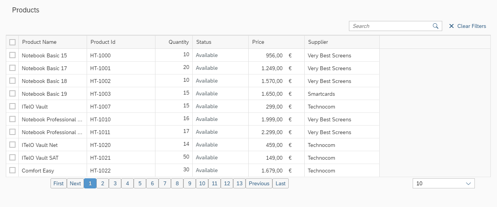
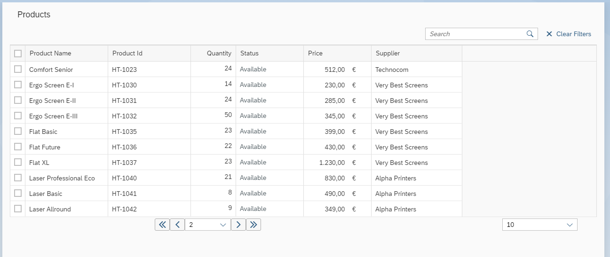

# Custom Paginator for Grid Table

In this blog post, I will mention how we add paginator to grid tables. Firstly, the paginator control was in older versions. After 1.38 version of UI5, we couldn’t add paginator in grid tables.

When I started coding the pagination structure, It seems very easy. But after some parts of filtering, sorting, changing page count functionality, it became more and more complex. For Example; if you will use filtering you should regenerate paginator vs.

After this workings, I plan to create a new custom control and use it in view in an easy way.

You can view it in [Plunker](http://embed.plnkr.co/9Jlh6N/).

First of all, I perform the rendering of the Paginator after each reporting process is finished. The point to be careful here is that we need to do the paginator again in all sorting and filtering operations.

I created the template for adding the paginator structure with the below code block. I am creating a separate template for Mobile.

Depending on the page count and item count, I fill the properties of my paginator object and init it. For mobile, I prefer to select control. If you want to examine the full code structure, you can access it from the [link](https://github.com/Yunustuzun/Paginator-in-Table-UI5).

I didn’t do anything on the View layer to create the Paginator function. In the next blog post, I aim to explain how we can activate it with a simple parameter on the View layer of the application, not writing any code on the controller side via custom controls.