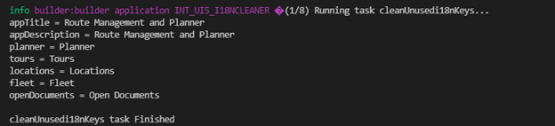

# UI5 Custom Task Creation and Usage 

## Intro

In UI5 tooling, a custom task can be used to include various operations during the build phase. As a simple demo, I will explain how we will remove the i18n texts that are not used in the project. This custom task will save time when you combine your project files from different workspaces and make your i18n texts redundant.


## Prepare task configuration

In the ui5.yaml file, we need to specify which task file to run and which runtime to consider.

````yaml
builder:
  customTasks:
    - name: cleanUnusedi18nKeys
      beforeTask: replaceCopyright
---
# Task extension as part of your project
specVersion: "2.1"
kind: extension
type: task
metadata:
  name: cleanUnusedi18nKeys
task:
  path: tasks/cleanUnusedi18nKeys.js
````

## Prepare task file
It is necessary to export a function in the following structure in the file to callback a continuous operation. The workspace object allows us to perform the desired operations on the files.

````javascript
module.exports = async function ({ workspace, dependencies, taskUtil, options }) {
.
.
````

## Logic
Our I18n keyword is searched for in the project files (controller, fragment, views). If it is not found, it is not inserted as a string in the new i18n file. All asynchronous functions are used with await keywords to continue with the synchronous process. 

````javascript
    const textResources = await workspace.byGlob("**/*{view.xml,fragment.xml,controller.js,manifest.json}");
    const i18nFiles = await workspace.byGlob("**/*.properties");
.
.
    await Promise.all(i18nFiles.map(async (i18nFile) => {
. 
.
        lines = lines.filter((l) => l.found === true);

        for (let i = 0; i < lines.length; i++) {
            line = lines[i];
            i18nString += line.key + " = " + line.value + "\n";
        }
        i18nString.substring(0, i18nString.length - 2);

        await i18nFile.setString(i18nString)

        await workspace.write(i18nFile).then(() => console.log('DONE'));
.
.
````

## Result

With the ui5 build command, the i18n keys that were not used in the workspace were deleted during the build phase. Unused i18n texts will not exist anymore.

|  | 
|:--:| 
| *after ui5 build command* |

## Final words
I have uploaded the repository code to [Github](https://github.com/Yunustuzun/UI5-i18n-cleaner) for you to use as a reference when building your custom task. The [API reference](https://sap.github.io/ui5-tooling/api/index.html) is provided for you to extend your requirements. Additionally, various libraries like Babel, Grunt.js can be used while performing these operations.

Custom tasks in [UI5 Tooling](https://sap.github.io/ui5-tooling/) allow us to perform file formatting, transpile, linting and other operations before or during the build phase. Thanks to contributors in the [UI5 Ecosystem](https://github.com/ui5-community/ui5-ecosystem-showcase) , we have many different out-of-box tasks that meet many requirements.

Enjoy!
