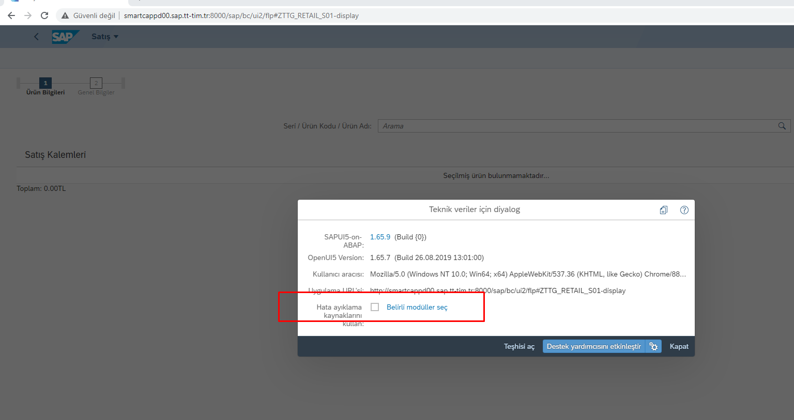
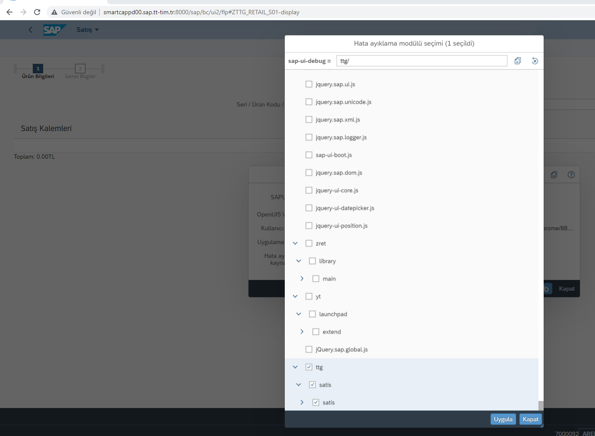
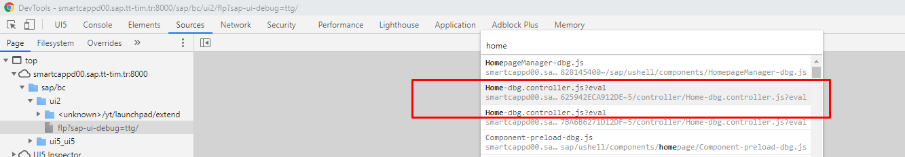

# Debug preload files in UI5

UI5 Inspector Browser Add-on should be installed.

Use `CTRL + ALT + Shift + P` shortcut 
 
It will add  `?sap-ui-debug=ttg/` parameter to url and you can debug original files.

 
 
 

