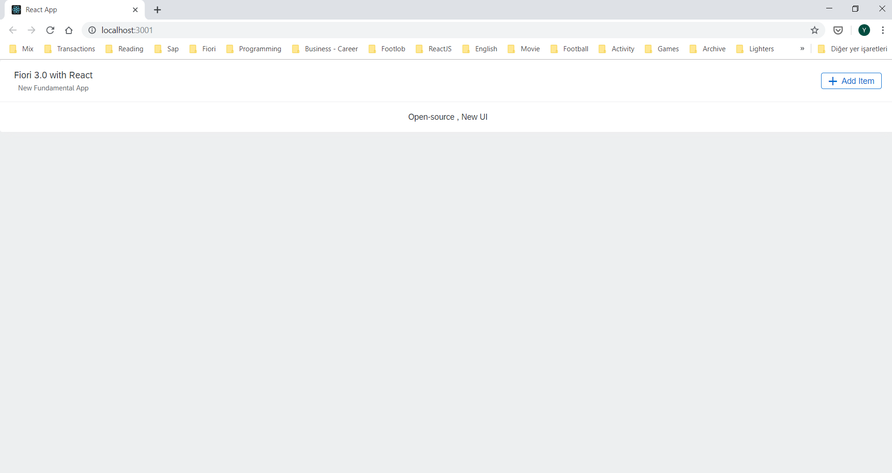

# Fundamentals for SAP Fiori Applications Intro

SAP Fundamentals allows you to make Fiori applications using the desired UI framework (React, Vue, Angular) technology.

With this solution SAP provide developers to build Fiori applications using the web-based technology with using open source NPM libraries. This allows developers to have more flexible structure and get benefits of various libraries.

Fundamentals will not replace instead of UI5 ​​framework technology.So the improvements in UI5 will not slow down or become outmoded. So Fiori Developers will not be dependent on a single technology and will have chance to choose their technology freely.


You can follow the latest news from the [Fundamental Github page](https://sap.github.io/fundamental/index.html)

You can see tecnical details , components below links for each technology.

[React](https://sap.github.io/fundamental-react)

[Angular JS](https://sap.github.io/fundamental-ngx)

[Vue](https://sap.github.io/fundamental-vue)

Let’s develop a simple application with React.JS Framework.

To be able to develop a React.JS project, we need to have a package manager program on our computer. Among them the most popular is the NPM. You can also use YARN package manager if you want.

We need to install [Node.js](https://nodejs.org/en/) from the link. Node.JS is the runtime environment for run javascript files in our PC. NPM will be installed defaultly if you finish the installation steps.

After the installation, You can open the Visual Studio Code , type the following code on terminal screen for creating the React application.

`npx create-react-app <project name>`

We should type `cd <project name>` for being in project folder.

Then we are installing react fundamental components with following command.

`npm install fundamental-styles fundamental-react` 

When the installation process is finished, project folder will include three folder .

node_modules folder, containing the library files

public folder, that is open to external access,

src folder, containing the source files

No more , So we can use React’s Fundamental components.We will create a simply web page with the Title, Text and Buttons in the Panel.

Let’s go to the App.js file. We need to import components before using them. Lets add the following code snippets to the top of the file.


````javascript
import {Panel} from 'fundamental-react/Panel';
import {Button} from 'fundamental-react/Button';
````

Let’s delete all code div elements except of  “App” class div . And add the following snippets.

````xml
<Panel>
    <Panel.Header>
        <Panel.Head
        description="New Fundamental App"
        title="Fiori 3.0 with React"
        />
        <Panel.Actions>
        <Button
            compact
            glyph="add">
            Add Item
    </Button>
        </Panel.Actions>
    </Panel.Header>

    <Panel.Body>
        Open-source , New UI
    </Panel.Body>
</Panel>
````

After completing all code changes , we can start the application by typing `npm start` to the terminal. App will view like below screen.



[See the sample code in Github](https://github.com/yunustuzun/sap-fundamental)

You can review the components above and use them in your developments. For more information click on the components.

In [Github community](https://github.com/sap/fundamental-react) you can get more information and contribute to libraries.